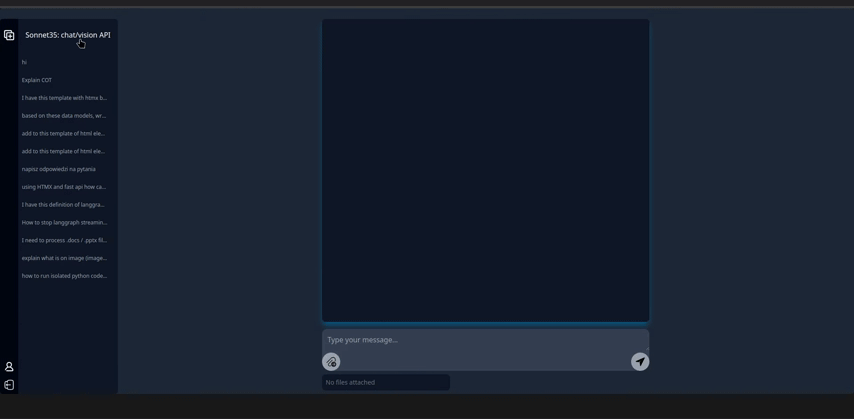
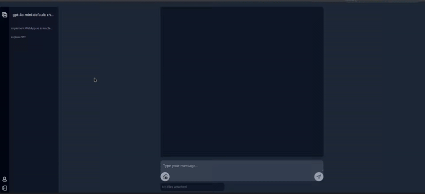
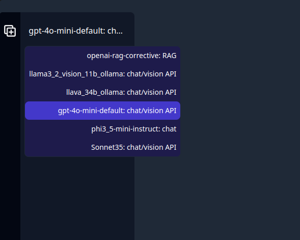

#  Skeernir


<!-- 

 -->

&nbsp;&nbsp;&nbsp;&nbsp;&nbsp;&nbsp;&nbsp;&nbsp;[Installation](#Installation)

####
Oh great! Just what we needed - yet another UI for locally deployed models... BUT this time it's for your **Agents!** How thrilling.
##### :exclamation: The project in an intensive development phase :exclamation:

### What’s the deal?  
- Build your AI Agents as fancy graphs with the oh-so-powerful [Langgraph](https://python.langchain.com/docs/langgraph).  
- Pair it with a super lightweight, crystal-clear UI! Forget bloated npm packages and convoluted JavaScript frameworks. Nope, this beauty runs on clean Python and [FastAPI](https://fastapi.tiangolo.com/) for the back-end, while the front-end rocks HTML, [HTMX](https://htmx.org/), and [Tailwind CSS](https://tailwindcss.com/). Oh, and a sprinkle of vanilla JS—because who doesn’t love a bit of extra fun?  
- Customize the UI for your Agents’ output—go wild! Use the MIT-licensed code to implement whatever your heart desires or play around predefined tools and pretty simple Jinja templates to render your Agent's inner workings.  

<div style="text-align: center;">
    
    
</div>

### Why does this even exist?  
Honestly? This project came to life to dodge the *joys* of Gradio or Streamlit integration. It’s a quick-and-dirty code base for prototyping agentic solutions without those pesky limitations. If you’re an AI dev like me, who prefers to avoid the murky waters of web development, you might actually find this pretty useful (or not :broken_heart: ).  

Oh, and contributions? Yes, please. Toxic comments? Even better—bring them on. 

### How does it work? 

Create file with in [src/graphs](src/graphs) and define function which returns your compiled graph. Decorate it using `@tool_graph`. Add config `.json` file in [configs](configs) folder if needed.
`@tool_graph` decorator takes the next arguments:
- `name` - string name of your Agent, the config filename should be the same 
- `tag` - some tag, will be appended to the name. Its up to you how to tag your agents
- `att_modals` - define modalities your Agent might work with. For now only "text" and "image" are available. By default `att_modals=['text']`

See exmpole for simple chatbot with gpt-4o-mini:

```python
from langgraph.graph import MessagesState, StateGraph, START, END
from langchain_openai import ChatOpenAI
from langgraph.checkpoint.memory import MemorySaver

from src.registry import tool_graph

@tool_graph(name='gpt-4o-mini-default', tag="chat/vision API", att_modals=['text', 'image'])
def get_openaigpt(api_token=None, **kwargs):
    
    memory = MemorySaver()
    kwargs.pop("port", None)
    sampling_data = kwargs.pop("sampling", {})

    model = ChatOpenAI(
        streaming=True,
        api_key=api_token,
        model="gpt-4o-mini-2024-07-18",
        **kwargs)
    
    # Define the function that calls the model
    async def call_model(state: MessagesState):
        response = await model.ainvoke(state["messages"], **sampling_data)
        return {"messages": response}

    # Define a new graph
    workflow = StateGraph(MessagesState)
    workflow.add_node("chatbot", call_model)
    workflow.add_edge(START, "chatbot")
    workflow.add_edge("chatbot", END)
    return workflow.compile(checkpointer=memory), model
```

In addition to compiled graph the function returns client instance to properly clean memory when you switch to another graph, however it's not obligatory. 

For this simple case the config file `configs/gpt-4o-mini-default.json` should contain:

```json
{
    "api_token": "<your token api>"
}
```
Graph will be available in UI.

 


#### Find more examples with [Llama.cpp](https://github.com/ggerganov/llama.cpp), [Ollama](https://github.com/ollama/ollama) and [vLLM](https://github.com/vllm-project/vllm) in [src/graphs](src/graphs). 

#### Take a look on [src/graphs/corrective_rag_example.py](src/graphs/corrective_rag_example.py) to integrate Agent's outputs and logs into the Skeernir interface!

:rocket::rocket::rocket: **More ready-to-use Agents and examples coming soon!**


## Features
- Working Spaces by user auth.
- Conversation History (keeps your attachments and Agents outputs!)
- Run llama.cpp / Ollama / vLLM servers in subprocess and terminate it
- Code highlighting and streaming
- Exctract text from PDF, PowerPoint, Word, Excel, etc. using [MarkItDown](https://github.com/microsoft/markitdown)
from attachments

## TODO
- More Agents! (Presentation Maker and Helper for this repo)
- Video in attachments
- Speach-to-text
- Text-to-speach
- Documentation

## Installation

Here's what you need to do to get your environment set up and get started:

### Setup Conda Environment with Python 3.11

1. Create a new conda environment with Python 3.11:
```console
conda create --name my_env python=3.11 
conda activate my_env
```
2. Update packages and install `ccache` and `cmake`:

```console
apt-get update
apt-get install ccache
apt-get install cmake
```

### Prepare for Graphs

Install Llama.cpp to use llama.cpp server. See [Llama.cpp](https://github.com/ggerganov/llama.cpp) for detailed instructions.
The same to [Ollama](https://github.com/ggerganov/llama.cpp) or [vLLM](https://github.com/vllm-project/vllm) 

You can communicate with your models and tools as you prefer, just implement your [Langgraph](https://python.langchain.com/docs/langgraph) Graph based on your previous projects or based on [examples](src/graphs) provided. 
For instance if you're going to work with LLM models using llama.cpp python bindings, perform the following steps:

1. In your newly created conda environment, install llama-cpp-python:

```console
pip install llama-cpp-python --upgrade --force-reinstall --no-cache-dir
```
If GPU on board:

```console
CMAKE_ARGS="-DGGML_CUDA=on" pip install llama-cpp-python --upgrade --force-reinstall --no-cache-dir
```

2. Finally install all dependencies from the requirements.txt file:
```console
pip install -r requirements.txt --no-cache-dir
```

For locally deployed models, refer to the following Python scripts as examples:

* [src/graphs/llama3_2_vision_11b_on_ollama_server.py](src/graphs/llama3_2_vision_11b_on_ollama_server.py)
* [src/graphs/phi3_5_mini_instruct_on_llamacpp_server.py](src/graphs/llama3_2_vision_11b_on_ollama_server.py)

and corresponding .json files in [configs](configs)

Grab those **GGUF files** (or whatever other format you fancy).  
Using Ollama? Don’t sweat it—models will magically pull themselves if they’re not already there.  

**Finally, create .env with next environment variables:**

```.env
SKEERNIR_PORT = "<port you prefer>"
LLAMA_CPP_PATH = "<your path to llama.cpp bin >/llama.cpp/build/bin/"
VLLM_PATH = "<your path to vllm>
SQLALCHEMY_DATABASE_URL = "sqlite:///./chat.db" # if db located in project root or change according your needs
```

Run 

```concole 
python main.py
```

How you deploy or configure your clients for APIs is totally on you. Want to run your LLMs or VLMs? Fine, just make sure you’ve got all the necessary packages installed (looking at you, [Llama.cpp](https://github.com/ggerganov/llama.cpp) and [Ollama](https://github.com/ggerganov/llama.cpp)).  

**Heads up:** This project isn’t here to hold your hand with deploying AI models locally. Nope, it’s laser-focused on your **Agents** and UI to work with them. So, if you’re into that, welcome aboard!  

### Project depends on
- [Langchain](https://github.com/langchain-ai/langchain)
- [Langgraph](https://python.langchain.com/docs/langgraph)
- [FastAPI](https://fastapi.tiangolo.com/)
- [HTMX](https://htmx.org/)
- [Tailwind CSS](https://tailwindcss.com/)
- [Prism](https://github.com/PrismJS/prism?tab=readme-ov-file)
- [MarkItDown](https://github.com/microsoft/markitdown)
- [Sqlalchemy](https://www.sqlalchemy.org/)

... 

and off course such projects like:
- [Llama.cpp](https://github.com/ggerganov/llama.cpp)
- [Ollama](https://github.com/ollama/ollama)
- [vLLM](https://github.com/vllm-project/vllm)
